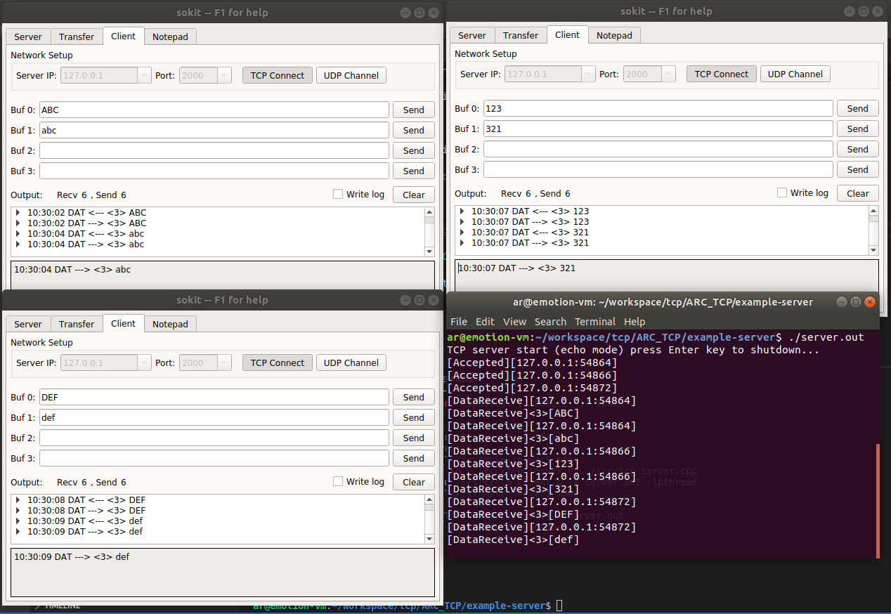
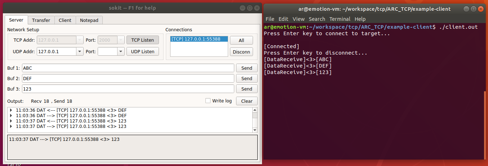

# ARC_TCP
Simple tcp library for Ubuntu/Debain

## Demo

tool software `sokit` is download from `https://github.com/sinpolib/sokit/releases`

### Server 

``` shell
cd example-server
make
./server.out
```




### Client

```shell
cd example-client/
make
./client.out
```




